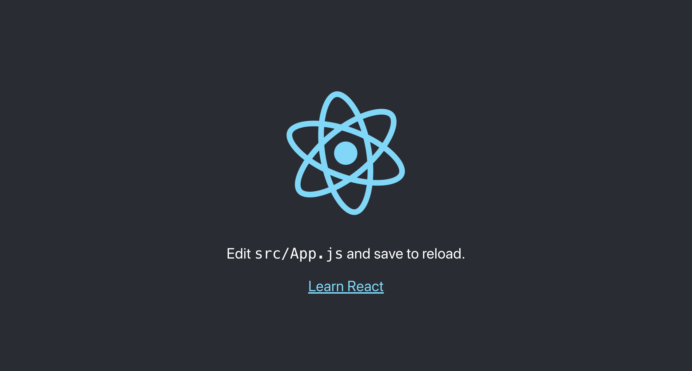

React is a Javascript library for building user interfaces.

Throughout this tutorial, you’ll learn how to set state using the `useState` and `useEffect` Hooks. To explore these different ways of setting state, you’ll create a dad joke's component that you’ll fetch new jokes from an API. By the end of this tutorial, you’ll be comfortable managing state in a functional component using Hooks, and you’ll have a foundation for more advanced Hooks such as useEffect, useMemo, and useContext.
You can check out the application that we will create in this tutorial.


#### Prerequisites

- Basic familiarity with HTML & CSS.
- Basic knowledge of JavaScript and programming.
- Basic understanding of the DOM.
- Familiarity with ECMAScript 2015 (arrow functions, destructuring, classes)
- Basic React knowledge like props, components, one way-data-flow

Here's the source and a live demo of the end result.

View Source on GitHub
View Demo

### What we will cover

- how to use `useState` with an array for the default value
- how to use `useState` with an object for the default value
- fetching an API with `useEffect`
- demo app to practice `useState` and `useEffect`

**By the end of the tutorial, you will have the following skill sets:**

The hands-on practical and real-life scenario of basic React Application using React Hooks

## What Are React Hooks?

Hooks are a new addition in React 16.8. With the help of hooks, we can use state and other React features without writing a class.
Hooks bring state and lifecycle methods to React Functional Components.
React Hooks makes developing apps easier with less complexity. It improves readability and organization of components.
We can create custom hooks to reuse code across our app.

## Basic React hooks

<p align="center"></p>

- `useState` is the most common hook that you will see. It is the `state hook` for declaring the state in our components.
- `useRef` is used to allow access directly to an element in the DOM and to create a mutable ref object that won't trigger a rerender.
- `useEffect` is used for _side effects_ like fetching data from an API.
- `useContext` allows us to easily work with the React Context API (solving the prop drilling issue)
- `useReducer` is an advanced version of `useState` for managing complex state logic. It’s quite similar to Redux.
- `useMemo` returns a value from a memoized function.
- `useCallback` returns a function that returns a cacheable value. Useful for performance optimization if you want to prevent unnecessary re-renders when the input hasn’t changed.
- `useLayoutEffect` similar to `useEffect` , they differ in when they trigger.
- `useImperativeHandle` to customize the instance value that’s exposed to parent components when using ref.
- `useDebugValue` displays a label for custom Hooks in React Developer Tools.

### Why Hooks?
 
Before Hooks:

- we would need to understand how **this** keyword works in Javascript, and to remember to bind event handlers in `class components`.
- Common way to attach logic externally to a component was to use the render props or Higher Order Components pattern.
- Composition instead of inheritance
- Best parts of mixins
- Replace prop drilling,

We needed to share stateful logic in a better way. React is designed to render components, and it doesn't know anything about routing, fetching data, or architecture of our project.
There wasn't a particular way to reuse stateful component logic and this made the code harder to follow.
So, React Hooks came to rescue.

Hooks are just functions that are exported from the official React page. They allow us to manipulate components in a different manner.

Hooks allow for attaching reusable logic to an existing component and use state and lifecycle methods inside a React functional component.
We can organize the logic inside a component into `reusable isolated units.` And we have a `better separation of concerns.`

There are some **rules** about how to use hooks. The following rules are:

- Only call hooks at the top level of the component.
- Don't call hooks inside loops, conditionals, or nested functions/
- Only call hooks from React functional components.
- Call them from within React functional components and not just any regular Javascript function
- Hooks can call other Hooks

You may ask, _Should I need to change my class components to hooks?_ Actually no, We can still use class components as 16.8 is backward compatible.

### Application Tools

- [x] Install [NodeJS](https://nodejs.org/en/) and make sure it is the LTS(long term support) version. LTS version is a less stable version of NodeJS. We will use NPM (node package manager) and we will use it to install **create-react-app**.
      
- [x] Install your preferred code editor or IDE. I will be using Visual Studio Code. You can download it from [this website](https://code.visualstudio.com/). It is free to use.
      
- [x] **create-react-app** is an npm package that we can bootstrap our React application without any configuration.
      

## How to Install React Hooks?

You need to either upgrade the version of React and React-DOM to `16.8.2` or create a new React project using Create React App.

In this tutorial, we’ll use Create React App to create a new React project.

Open your terminal and run the following to create the new project:

```bash
# cd into the directory you want to create the project.
cd desktop

# type this command to install create-react-app, you can give any name for the app.
npx create-react-app myApp

# Let's go inside our project folder, type the name of our project, and `cd` into it.
cd myApp

# open the project files with Visual Studio or any code editor
#start the app
npm start
```

Your default browser will open and you’ll see your new React app.



Now we can see our app is up and running. Before starting our app, let's make some cleanup and remove some of the files that we will not use.

Let's remove `App.test.js, index.css, logo.svg, setupTests.js` from the `src` folder. You can copy and paste the basic structure for `App.js` and `index.js` from the code snippets below.

```javascript
// App.js

import React from 'react';
import './App.css';

function App() {
  return <div className="App"></div>;
}

export default App;
```

```javascript
// index.js

import React from 'react';
import ReactDOM from 'react-dom';
import App from './App';
import * as serviceWorker from './serviceWorker';

ReactDOM.render(<App />, document.getElementById('root'));

// If you want your app to work offline and load faster, you can change
// unregister() to register() below. Note this comes with some pitfalls.
// Learn more about service workers: https://bit.ly/CRA-PWA
serviceWorker.unregister();
```

Also, we can remove `logo` files from the `public` folder, now my files are looking like this:


