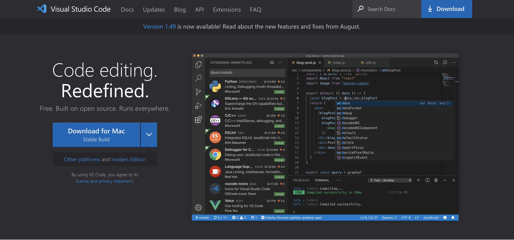

React is a Javascript library for building user interfaces. You may have worked with class components, and didn't understand why developers are using hooks. As a beginner, it's hard to know which one to use, for example, there are legacy codes written in class components, and you need to refactor it to functional components using Hooks, or you just want to learn the new React, and don't want to invest time learning class components. If you are thinking like this, you are in the right place. This tutorial will show you the details about using `useState` and `useEffect` hooks, as you progress, you can go on with different hooks, and libraries. React is a huge topic and you will be shocked that there are so many different things that you can do with React only. So, fasten your seatbelts, and enjoy the ride.


### What we will cover 

Throughout this tutorial, you’ll learn how to set state using the `useState` and `useEffect` Hooks. You’ll create different components and for the last component we will combine these two hooks and create a recipe app that you’ll fetch new recipes from an API. More specifically, we will learn how to: 

- use `useState` with an array for the default value
- use `useState` with an object for the default value
- use `useEffect` without a Dependency Array
- use `useEffect` with an Empty Dependency Array
- use `useEffect` with a Non-empty Dependency Array
- use `useEffect` with cleanup function
- fetch an API with `useEffect`

**By the end of the tutorial, you will have the following skill sets:**

- The hands-on practical and real-life scenario of basic React Application using React Hooks.
- You will manage state in a functional component using Hooks, and you’ll have a foundation for more advanced Hooks such as `useCallback`, `useMemo`, and `useContext`.

Here's the source and a live demo of the end result.

View Source on GitHub

View Demo

#### Prerequisites

- Basic familiarity with HTML & CSS.
- Basic knowledge of JavaScript and programming.
- Basic understanding of the DOM.
- Familiarity with ECMAScript 2015 (arrow functions, destructuring, classes)
- Basic React knowledge like props, components, one way-data-flow


## What Are React Hooks?

Hooks are a new addition in React 16.8. With the help of hooks, we can use state and other React features without writing a class.
Hooks allow for attaching reusable logic to an existing component and use state and lifecycle methods inside a React functional component.
We can organize the logic inside a component into `reusable isolated units`, and we have a `better separation of concerns.`
React Hooks makes developing apps easier with less complexity. It improves readability and organization of components.
We can create custom hooks to reuse code across our app.


I want to start our tutorial with the general overview of our hooks. This will you a big picture about hooks, then we will dig deeper into our two commonly used hooks. You can just skim over these and use it as a reference when you need. This may be overwhelming; but no need to worry right now. 

## React Hooks

<p align="center"></p>

- `useState` is the most common hook that you will see. It is the `state hook` for declaring the state in our components.
- `useEffect` is used for _side effects_ like fetching data from an API.
- `useRef` is used to allow access directly to an element in the DOM and to create a mutable ref object that won't trigger a rerender.
- `useContext` allows us to easily work with the React Context API (solving the prop drilling issue)
- `useReducer` is an advanced version of `useState` for managing complex state logic. It’s quite similar to Redux.
- `useMemo` returns a value from a memoized function.
- `useCallback` returns a function that returns a cacheable value. Useful for performance optimization if you want to prevent unnecessary re-renders when the input hasn’t changed.
- `useLayoutEffect` similar to `useEffect` , they differ in when they trigger.
- `useImperativeHandle` to customize the instance value that’s exposed to parent components when using ref.
- `useDebugValue` displays a label for custom Hooks in React Developer Tools.

In this tutorial, we will focus on the most common hooks: `useState` and `useEffect`. But first, let's start with _the why we need hooks in the first place._

## Why Hooks?
 
Before Hooks:

- We would need to understand how **this** keyword works in Javascript, and to remember to bind event handlers in `class components`.
- Common way to attach logic externally to a component was to use the `render props` or `Higher Order Components` pattern.


We needed to share stateful logic in a better way. React is designed to render components, and it doesn't know anything about routing, fetching data, or architecture of our project.
There wasn't a particular way to reuse stateful component logic and this made the code harder to follow.
So, React Hooks came to rescue.

<p align="center"><em>Or, maybe a Superman??</em></p>


Hooks are just functions that are exported from the official React page. They allow us to manipulate components in a different manner.

There are some **rules** about how to use hooks. The following rules are:

1. Only call hooks at the top level of the component.
2. Don't call hooks inside loops, conditionals, or nested functions/
3. Only call hooks from React functional components.
4. Call them from within React functional components and not just any regular Javascript function
5. Hooks can call other Hooks

You may ask, _Should I need to change my class components to hooks?_ Actually NO, we can still use class components as 16.8 is backward compatible.

## Application Tools

- [x] Install [NodeJS](https://nodejs.org/en/) and make sure it is the LTS(long term support) version. LTS version is a less stable version of NodeJS. We will use NPM (node package manager) and we will use it to install **create-react-app**.


- [x] Install your preferred code editor or IDE. I will be using Visual Studio Code. You can download it from [this website](https://code.visualstudio.com/). It is free to use.



- [x] **create-react-app** is a npm package that we can bootstrap our React application without any configuration.
      


## How to Install React Hooks?

You need to either upgrade the version of React and React-DOM to `16.8.2` or create a new React project using Create React App.

In this tutorial, we’ll use Create React App to create a new React project.

Open your terminal and run the following to create the new project:

```bash
# cd into the directory you want to create the project.
cd desktop

# type this command to install create-react-app, you can give any name for the app.
npx create-react-app myApp

# Let's go inside our project folder, type the name of our project, and `cd` into it.
cd myApp

# open the project files with Visual Studio or any code editor
# start the app
npm start
```

Your default browser will open and you’ll see your new React app.


Now we can see our app is up and running. Before starting our app, let's make some cleanup and remove some of the files that we will not use.

Let's remove `App.test.js, index.css, logo.svg, setupTests.js` from the `src` folder. You can copy and paste the basic structure for `App.js` and `index.js` from the code snippets below.


```javascript
// App.js

import React from 'react';
import './App.css';

function App() {
  return <div></div>;
}

export default App;
```


```javascript
// index.js

import React from 'react';
import ReactDOM from 'react-dom';
import App from './App';
import * as serviceWorker from './serviceWorker';

ReactDOM.render(<App />, document.getElementById('root'));

// If you want your app to work offline and load faster, you can change
// unregister() to register() below. Note this comes with some pitfalls.
// Learn more about service workers: https://bit.ly/CRA-PWA
serviceWorker.unregister();
```

Also, we can remove `logo` files from the `public` folder, now my files are looking like this:


### Important Note: 

Throughout this tutorial, I will create multiple components and you need to import the components to `App.js` to see how it is working. I have used `react-router-dom` to show all the components in one app; but we will not talk about routing in this tutorial. That's why you need to create a folder under `src` directory named `components` and create the components there, then import it to `App.js`. Example:

```javascript
// App.js

import React from 'react';
// import the new component here
import import StateHook from './components/StateHook';

import './App.css';

function App() {
	return (
    <div>
    {/* render the component  */}
      <StateHook />
	</div>
	);
}

export default App;
```


## Styling the Application

I have used [Semantic UI](https://semantic-ui.com/) and custom CSS for styling. For Semantic UI, I have added a `link` tag inside my `public > index.html` file like this:

```html
<link href="https://cdnjs.cloudflare.com/ajax/libs/semantic-ui/2.4.1/semantic.min.css" rel="stylesheet" />
```

`className` attribute values are coming from Semactic UI or CSS. You don't need to focus on those.

For the CSS code, you can copy these styles inside `App.css` file.

```css
body {
  padding: 10px;
  font-family: sans-serif;
  background-color: #f69e9e;
  line-height: 1.2;
}

.container {
  text-align: center;
  margin-top: 5rem;
  width: 90vw;
  margin: 0 auto;
  max-width: 1170px;
  min-height: 100vh;
}

h1 {
  color: #371e30;
  letter-spacing: 10px;
  text-transform: uppercase;
  margin: 0 0 10px;
}

h2 {
  font-weight: bold;
  font-size: 1em;
  line-height: 1.2em;
  padding: 0;
  color: #222;
  font-size: 30px;
}

a {
  text-decoration: none;
  color: #222;
  font-weight: 600;
}

ul {
  vertical-align: bottom;
  margin: 0 20px;
  padding: 0 0 25px 0;
  text-align: left;
}

p {
  font-weight: bolder;
  font-size: 1em;
  text-align: left;
}

input[type='text'] {
  width: 60%;
  padding: 12px 20px;
  margin: 8px 0;
  display: inline-block;
  border-radius: 4px;
  box-sizing: border-box;
  background: #fff;
}

.btn {
  display: block;
  margin: 0 auto;
  padding: 0.25rem 0.75rem;
  border-color: transparent;
  text-transform: capitalize;
  font-size: 1.4rem;
  margin-top: 2rem;
  cursor: pointer;
  background-color: #ddd;
  color: black;
}

.btn:hover,
a:hover {
  border: 1px solid #df57bc;
  background-color: #df57bc;
  padding: 5px;
  color: #fff;
}


.recipe {
  border-radius: 10px;
  margin: 40px;
  min-width: 40%;
  padding: 40px;
  max-width: 400px;
  background: white;
  box-shadow: 0 1px 3px rgba(0, 0, 0, 0.12), 0 1px 2px rgba(0, 0, 0, 0.24);
}
```


Now, with this we are ready to go. 🥳

