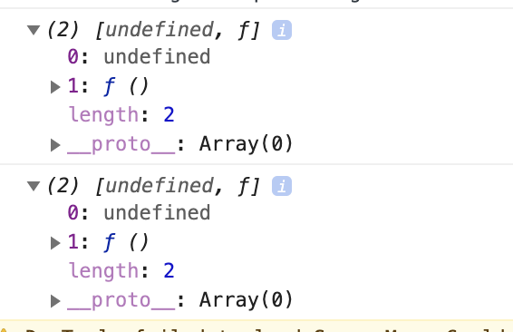
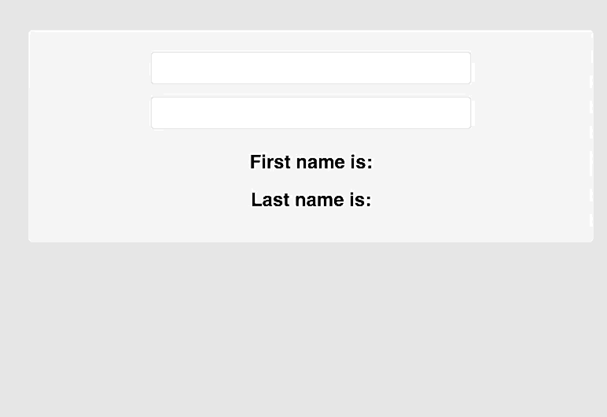
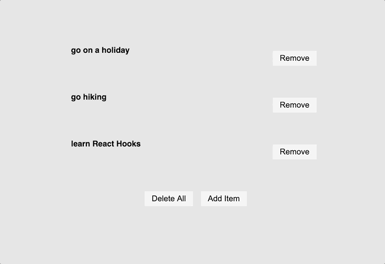

State helps build highly performant web apps. To keep track of our application logic, we need to use `useState`. We can reflect any UI or the user interface changes via changes in state.

`useState` function lets you use state in a functional component.

In order to use, `useState` in our component, we have to import `useState` first. `useState` is a named export; so, we will export it with curly braces.

`import React, { useState } from 'react';`

Let's make an example of how to use `useState`.

Now, create a new folder named `components` under `src` directory, create a new file and name it `ExampleComponent.js` inside `components` directory. Then copy this code into the `ExampleComponent.js`

```javascript
// src > components > ExampleComponent.js

import React, {useState} from 'react';

const ExampleComponent = () => {
  const [title, setTitle] = useState('hello world');

  // returns a function
  console.log(useState());

  const handleClick = () => {
    setTitle('change my title');
  };

  return (
    <>
      <div className="App">
        <h2>{title}</h2>
        <button type="button" onClick={handleClick}>
          Change title
        </button>
      </div>
    </>
  );
};

export default ExampleComponent;
```

Now, let's import our code into `App.js`

```javascript
// src > App.js
import React from 'react';
import './App.css';
import ExampleComponent from './components/ExampleComponent';

const App = () => {
  return (
    <div>
      <ExampleComponent />
    </div>
  );
};

export default App;
```

Also, go into your `App.css` file and add this css code.

```css
/* src > App.css */

body {
  padding: 10px;
  font-family: sans-serif;
  background-color: #f69e9e;
  line-height: 1.2;
}

.container {
  text-align: center;
  margin-top: 5rem;
  width: 90vw;
  margin: 0 auto;
  max-width: 1170px;
  min-height: 100vh;
}

h1 {
  color: #371e30;
  letter-spacing: 10px;
  text-transform: uppercase;
  margin: 0 0 10px;
}

a {
  text-decoration: none;
  color: #222;
  font-weight: 600;
}

ol {
  list-style-type: none;
}

.recipe__list {
  margin: 0 20px;
  padding: 0;
  text-align: left;
}

input[type='text'] {
  width: 60%;
  padding: 12px 20px;
  margin: 8px 0;
  display: inline-block;
  border-radius: 4px;
  box-sizing: border-box;
  background: #fff;
}

.btn {
  display: block;
  margin: 0 auto;
  padding: 0.25rem 0.75rem;
  border-color: transparent;
  text-transform: capitalize;
  font-size: 1.4rem;
  margin-top: 2rem;
  cursor: pointer;
  background-color: #ddd;
  color: black;
}

.btn:hover {
  border: 1px solid #df57bc;
  background-color: #df57bc;
  color: #fff;
}

.item {
  display: flex;
  justify-content: space-between;
  max-width: 500px;
  margin: 2rem auto;
  align-items: center;
}

.formContainer {
  min-height: 10vh;
  display: flex;
  justify-content: center;
  align-items: center;
}

.recipes {
  display: flex;
  justify-content: space-around;
  flex-wrap: wrap;
}

.recipe {
  border-radius: 10px;
  box-shadow: 0px 5px 20px rgb(71, 71, 71);
  margin: 20px;
  display: flex;
  flex-direction: column;
  justify-content: space-around;
  background-color: #fff;
  align-items: center;
  min-width: 40%;
  flex-wrap: wrap;
}
```




`useState` function returns an array of two items:

- the first element is the _current value of the state_.
- the second is a _state setter/updater function_. We use to update our state.

```javascript
// destructuring an array
const [title, setTitle] = useState('hello world');
```

Developers generally prefer array destructuring with `useState` hook or we need to write more verbose code like this:

```javascript
const items = useState('hello world');
const title = items[0];
const setTitle = items[1];
```

You may ask, _How React knows when to render?_ React components will only rerender when its props or state have changed. Props are passed into a component and read-only, whereas a state holds information about the component, and can be updated.

During the initial render, the returned state is the same as the value passed as the first argument (initialState).
The `setState` function is used to update the state. It accepts a new state value and rerenders the component.

State tracks the value of our state. The setter function updates the state, and rerenders JSX elements.

In class components, the state is always an object, with the `useState` hook, the state does not have to be an object. Instead, you can break up state into multiple pieces that you can update independently.

## useState with objects

First, let's create a new component under `src` folder, name it `ExampleComponent3`, and copy this code:

```javascript
import React, {useState} from 'react';

const ExampleComponent2 = () => {
  const [name, setName] = useState({firstName: '', lastName: ''});

  return (
    <div className="formContainer">
      <form>
        <input
          type="text"
          value={name.firstName}
          onChange={(e) => setName({firstName: e.target.value})}
        />
        <input
          type="text"
          value={name.lastName}
          onChange={(e) => setName({lastName: e.target.value})}
        />
        <h2>First name is: {name.firstName}</h2>
        <h2>Last name is: {name.lastName}</h2>
      </form>
    </div>
  );
};

export default ExampleComponent2;
```

Now, again let's import this component into 'App.js`.

Again, let’s break down the code above to explain what we’ve added and how it works.

- importing the `useState` hook from React
- creating a new constant that returns `name` and `setName` from useState.
- initializing the `useState` hook with an object.
- create a form to display our inputs and h2 tags
- add `value` property and `onChange` event handler to our inputs. `e.target.value` will give us the value in the input field,
- adding button with an `onClick` handler that invokes the `setItems` function of useState with an empty array.

The important part about this component, we need to focus on `onChange` event handler. `onChange` event fires whenever the user types in something.
Whenever the first input value changes, we update the `firstName` property, and when the second input value changes, we update the `lastName` property.

Let's now import the component into our `App.js` component.

```javascript
// src > App.js

import React from 'react';
import './App.css';
// import ExampleComponent from './components/ExampleComponent';
import ExampleComponent2 from './components/ExampleComponent2';

const App = () => {
  return (
    <div className="container">
      {/* <ExampleComponent /> */}
      <ExampleComponent2 />
    </div>
  );
};

export default App;
```



We have a problem with updating our states; so, as you can see, we can update both input fields; but when we switch between them we cannot keep track of our old state.

Let's add one line of code to see what is happening.

```javascript
// src > components > ExampleComponent3
// ...
  <h2>Last name is: {name.lastName}</h2>

  <h2>{JSON.stringify(name)}</h2>
```


When we type for first name, last name input is disappearing. Because state doesn't automatically merge and update the object.
In class components setState will merge the state, `useState` hook will not merge the state. To handle this, we will use `spread operator` to merge. With this, setter object will copy every in the `name` object, and overwrite the `firstName` or `lastName` fields with a different value.

Let's see this in our code:

```javascript
// src > components > ExampleComponent3

return (
  <div className="formContainer">
    <form>
      <input
        type="text"
        value={name.firstName}
        onChange={(e) => setName({...name, firstName: e.target.value})}
      />
      <input
        type="text"
        value={name.lastName}
        onChange={(e) => setName({...name, lastName: e.target.value})}
      />
      <h2>First name is: {name.firstName}</h2>
      <h2>Last name is: {name.lastName}</h2>
      <h2>{JSON.stringify(name)}</h2>
    </form>
  </div>
);
```

When dealing with objects or arrays, always make sure to spread your state variable and then call the setter function. Because, `useState` do not "merge" its arguments with the old state. They just set the state. Every time, with every rerender we don't mutate our state, we get a completely new state, we can change our state, with the setter function.

Some Key Points:

- We `shouldn't mutate the state` in our components.
- We need to pass previous state by the state setter(with the spread operator)

## useState with arrays

The initial value of `useState` can be of any type, like an array, an object, a boolean, a number, a string, etc. We can see an example with an array as an initial value.

```javascript
import React, {useState} from 'react';

const ExampleComponent3 = () => {
  // pass an array for default value
  const [items, setItems] = useState([
    {id: 1, listItem: 'go on a holiday'},
    {id: 2, listItem: 'go hiking'},
    {id: 3, listItem: 'learn React Hooks'},
  ]);

  // remove items
  const removeItem = (id) => {
    setItems(items.filter((item) => item.id !== id));
  };

  const addItem = () => {
    setItems([
      ...items,
      {
        id: 4,
        listItem: 'finish deadlines',
      },
    ]);
  };

  return (
    <>
      {items.map((item) => {
        const {id, listItem} = item;
        return (
          <div key={id} className="item">
            <h4>{listItem}</h4>
            <button onClick={() => removeItem(id)}>remove</button>
            <button onClick={() => addItem(id)}>add</button>
          </div>
        );
      })}

      <button onClick={() => setItems([])}>Delete all</button>
    </>
  );
};

export default ExampleComponent3;
```

Now, again let's import this component into 'App.js`.

```javascript
// src > App.js

import React from 'react';
import './App.css';
// import ExampleComponent from './components/ExampleComponent';
// import ExampleComponent2 from './components/ExampleComponent2';
import ExampleComponent3 from './components/ExampleComponent3';

const App = () => {
  return (
    <div className="container">
      {/* <ExampleComponent /> */}
      {/* <ExampleComponent2 /> */}
      <ExampleComponent3 />
    </div>
  );
};

export default App;
```

Let’s break down the code above to explain what we’ve added and how it works.

- importing the `useState` hook from React
- creating a new constant that returns `items` and `setItems` from useState.
- initializing the `useState` hook with an array of objects.
- mapping over the array to get each array item
- returning JSX elements to display our array items
- adding a remove button for every item
- adding a button with an `onClick` handler that invokes the `setItems` function of `useState` with an empty array. So, we can remove everything from our array.
- adding a add button, when it is clicked on it adds a new item. We merge the old state with the updated state with the help of ES6 spread operator.


