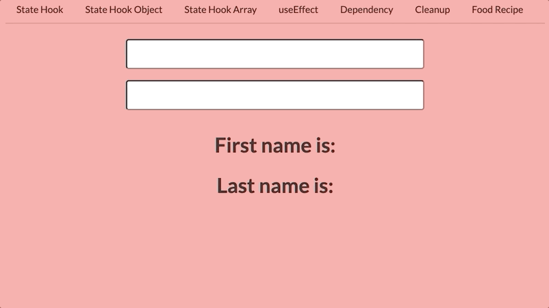
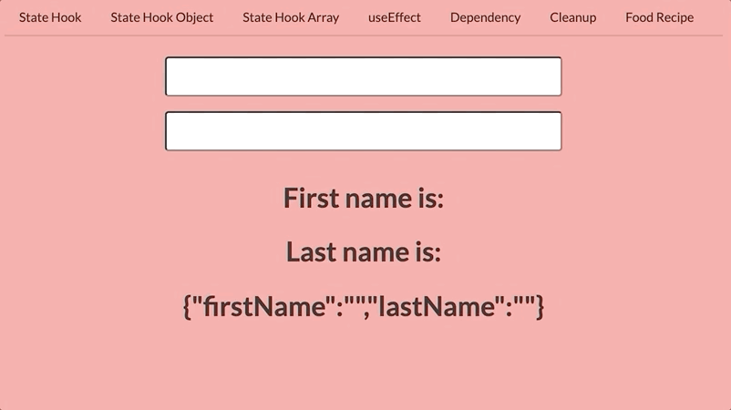
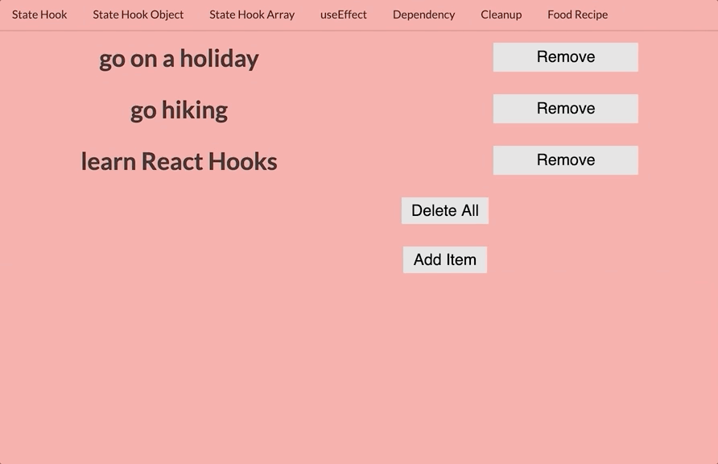

State helps build highly performant web apps. To keep track of our application logic, we need to use `useState`. We can reflect any UI(user interface) changes via changes in state.

`useState` function lets you use state in a functional component.

In order to use, `useState` in our component, we have to import `useState` first. `useState` is a named export; so, we will export it with curly braces.

`import React, { useState } from 'react';`

Let's make an example of how to use `useState`.

Create a new file inside `components` directory and name it `StateHook.js`.Then copy this code into the `StateHook.js`, and let's see what we get. Also, don't forget to import this component into `App.js`.

```javascript
// src > components > StateHook.js

import React, {useState} from 'react';

const StateHook = () => {
  
  const [title, setTitle] = useState('hello world');

// update the state with setTitle function
  const handleClick = () => {
    setTitle('React is cool');
  };

  return (
    <div className="container">
      <h2>{title}</h2>
      <button type="button" onClick={handleClick} className="btn">
        Change title
      </button>
    </div>
  );
};

export default StateHook;

```


`useState` returns an array of two items:

- the first element is the _current value of the state_.
- the second is a _state setter/updater function_. We use to update our state.

In short, state tracks the value of our state. The setter function updates the state, and rerenders JSX elements.

```javascript
// destructuring an array
// initial state is 'hello world'
const [title, setTitle] = useState('hello world');
```

Developers generally prefer array destructuring with `useState` hook or we need to write more verbose code like this:

```javascript
const items = useState('hello world');
const title = items[0];
const setTitle = items[1];
```

You may ask, _How React knows when to render?_ React components will only rerender when its props or state have changed. Props are passed into a component and read-only, whereas a state holds information about the component, and can be updated. During the initial render, the returned state is the same as the value passed as the first argument (initialState).

So, here we updated our state with `setTitle` setter function and passed a different string inside of it. When the button gets clicked, we are updating the state with  `onClick event handler`. The `setTitle` function accepts a new state value and rerenders the component. 

In class components, the state is always an object, with the `useState` hook, the state does not have to be an object. Instead, you can break up state into multiple pieces that you can update independently.

## useState with objects

What I mean by the title is we will create an object inside our `useState` hook, instead of passing a string. The initial value of `useState` can be of any type, like an array, an object, a boolean, a number, a string, etc.

First, let's create a new component under `components` folder, name it `StateHookObject.js`, and copy this code:

```javascript
// src > components > StateHookObject.js
import React, {useState} from 'react';

const StateHookObject = () => {
  // pass an object for the initial state
  const [name, setName] = useState({firstName: '', lastName: ''});

  return (
    <form>
        <input
          type="text"
          value={name.firstName}
          // set firstName to whatever is typed inside the input field
          onChange={(e) => setName({firstName: e.target.value})}
        />
        <input
          type="text"
          value={name.lastName}
          // set lastName to whatever is typed inside the input field
          onChange={(e) => setName({lastName: e.target.value})}
        />
        <h2>First name is: {name.firstName}</h2>
        <h2>Last name is: {name.lastName}</h2>
    </form>
  );
};

export default StateHookObject;
```

Now, let’s break down the code above to explain what we’ve added and how it works.

- importing the `useState` hook from React
- creating a new constant that returns `name` and `setName` from `useState`.
- initializing the `useState` hook with an object.
- create a `form` to display our inputs and `h2` tags
- add `value` property and `onChange` event handler to our inputs. `e.target.value` will give us the value inside the input field.

The important part about this component, we need to focus on `onChange` event handler. `onChange` event fires whenever the user types in something.
Whenever the first input value changes, we update the `firstName` property, and when the second input value changes, we update the `lastName` property.

Okay, everything looks perfect. Now, let's test our code.



We have a problem with updating our states; so, as you can see, we can update both input fields; but when we switch between them we cannot keep track of our old state.

Let's add this one line of code to see what is happening.

```javascript
// src > components > StateHookObject.js
// ...
  <h2>Last name is: {name.lastName}</h2>

// add this line to your code
  <h2>{JSON.stringify(name)}</h2>
  </form>
```



When we type for the first name input, the last name input is disappearing. **Because state doesn't automatically merge and update the state.** `useState` does not "merge" its arguments with the old state. They just set the state. Every time, with every rerender we don't mutate our state, we get a completely new state, we can change our state with the setter function.

In class components `setState` will merge the state, `useState` hook will not merge the state. To handle this, we will use `spread operator` to merge. With this, setter object will copy every in the `name` object, and overwrite the `firstName` or `lastName` fields with a different value.

Let's see this in our code:

```javascript
// src > components > StateHookObject

// ...
return (
  <form>
      <input
        type="text"
        value={name.firstName}
        // add spread operator
        onChange={(e) => setName({...name, firstName: e.target.value})}
      />
      <input
        type="text"
        value={name.lastName}
        // add spread operator
        onChange={(e) => setName({...name, lastName: e.target.value})}
      />
      <h2>First name is: {name.firstName}</h2>
      <h2>Last name is: {name.lastName}</h2>
      <h2>{JSON.stringify(name)}</h2>
  </form>
);
```


Some Key Points:

- We `shouldn't mutate the state` in our components.
- We need to pass previous state by the state setter(with the spread operator)

## useState with arrays


Now, we will make another component that we will use an array for the initial state. Let's see what will happen. Create a new file under components directory and name it `StateHookArray.js` and copy this code. Again don't forget to import into `App.js`

```javascript

// src > components > StateHookArray.js

import React, { useState } from 'react';

const StateHookArray = () => {
    const [ items, setItems ] = useState([
      { id: 1, listItem: 'go on a holiday' },
      { id: 2, listItem: 'go hiking' },
      { id: 3, listItem: 'learn React Hooks' }
    ]);

    // remove items
    const removeItem = (id) => {
      setItems(items.filter((item) => item.id !== id));
    };

    const addItem = () => {
      setItems([
        // don't mutate the array, use spread operator to get the previous state
        ...items,
        // add new item
        {
          id: 4,
          listItem: 'meet deadlines'
        }
      ]);
    };

    return (
      <div className="ui container">
        <div className="ui grid">
          {items.map((item) => {
            const { id, listItem } = item;
            return (
              <div key={id} className="row">
                <h2 className="five wide column">{listItem}</h2>
                {/* when it is clicked, remove the individual item */}
                <button className="three wide column btn" onClick={() => removeItem(id)}>
                  remove
                </button>
              </div>
            );
          })}
        </div>
        {/* when it is clicked, empty the whole array */}
        <button className="btn" onClick={() => setItems([])}>
          Delete all
        </button>
        {/* when it is clicked, add one new item to the list */}
        <button className="btn" onClick={() => addItem()}>
          Add Item
        </button>
      </div>
    );
  };

export default StateHookArray;
	

```

Let’s break down the code above to explain what we’ve added and how it works.

- importing the `useState` hook from React
- creating a new constant that returns `items` and `setItems` from `useState`.
- initializing the `useState` hook with an array of objects.
- returning some JSX elements and Semantic UI to add a grid system
- mapping over the array to get each array item
- returning JSX elements to display our array items
- adding a remove button for every item, when it is clicked, we can remove the individual item 
- adding a button with an `onClick` handler that invokes the `setItems` function of `useState` with an empty array. So, we can remove everything from our array.
- adding an add button, when it is clicked on it adds a new item. We merge the old state with the updated state with the help of ES6 spread operator.



And yes, we are done with the `useState` hook. 🥳
