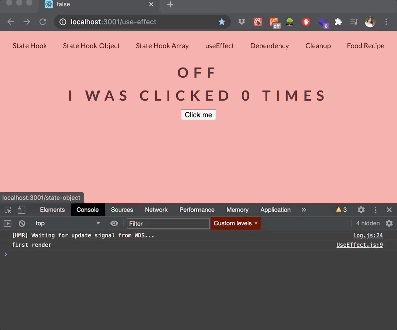
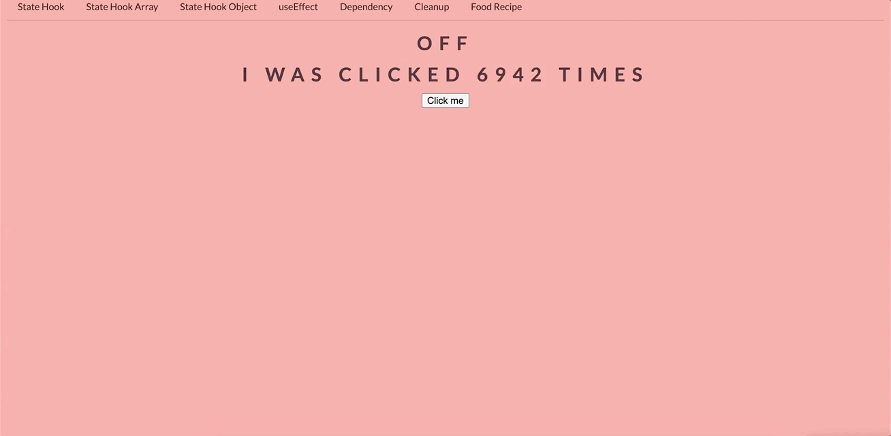

If you’ve written React class components before, you should be familiar with lifecycle methods like `componentDidMount`, `componentDidUpdate`, and `componentWillUnmount`. The `useEffect` Hook is all three of these lifecycle methods combined. It's used for side effects (all things which happen outside of React) like network requests, managing subscriptions, DOM manipulation, setting up event listeners, timeouts, intervals, or local storage, etc.

`useEffect` functions run after every rerender by default.
It doesn't matter what caused the render like changing the state, or maybe new props, the effect will be triggered after rendering.

Setting the title of the page will also be a side effect.
`useEffect` takes a callback function, we can tell `useEffect` when the code we want to be executed with the second argument. This will control the effect.

For the second argument, we can use `useEffect` in three different ways:
 
## 1. useEffect without a Dependency Array

To make this clear for you I want to make an analogy, imagine you have a car, and you never need to buy gas or even start the car, it just goes anywhere you want. Now, back to code!


```javascript
// runs after every rerender
useEffect(() => {
  console.log('I run after every render and at initial render');
});
```

This renders every time our app renders and at initial render. But we don't want to render each time, this can cause _an infinite loop_ and we should avoid this.

We need to optimize our components. We can pass _a list of dependencies_. The dependency will trigger an effect on the change of the dependencies.

Let's see it in a simple example.

```javascript

//  src > components > UseEffect.js

import React, { useState, useEffect } from 'react';

const UseEffect = ()  => {
  const [count, setCount] = useState(0);
  const [isOn, setIsOn] = useState(false;)

// useEffect to set our document title to isOn's default state
  useEffect(() => {
    document.title = isOn;
    console.log('first render');
  });

const handleClick = () => {
  setIsOn(!isOn);
  setCount(count + 1)
}
  return (
  <div>
    <h1>{isOn ? "ON" : "OFF"}</h1>
    <h1>I was clicked {count} times</h1>
    <button onClick={handleClick} className="btn">Click me</button>
  </div>
  );
}

export default UseEffect;
```

In our example, we have two states: `count` and `isOn`. We are rendering these with our `button` and `h1` tags. When the button gets clicked, we are setting the `isOn` state to the opposite of its state.

For the purpose of this example, we are setting `useEffect` hook and changing our document title to our `isOn`'s default value(false).

With our `console.log`, we can see that we rerender our component with our initial render and whenever we click the button. Because we don't have any array dependency.




## 2. useEffect with an Empty Dependency Array

Now, for the second scenario, we have a car but first, we need to start the car, after that no need to update anything, just one time start the car.


```javascript
// runs at initial render
useEffect(() => {
  console.log('I only run once');
}, []);
```

This only runs once when the component is mounted or loaded.

It looks exactly like the behavior of `componentDidMount` in React classes. But we shouldn't compare with React class components.

## 3. useEffect with a Non-empty Dependency Array 

The last analogy is the real-life scenario, we have a car and we need to buy gas, change the oil, etc. We depend on other stuff to start our car. So, we need to update/refill gas to drive the car.


```javascript
// runs after every rerender if data has changed since last render
useEffect(() => {
  console.log('I run whenever some piece of data has changed)');
}, [id, value]);
```

If the variable is inside this array, we will trigger this effect only when the value of this variable changes, and not on each rerender. Any state or props we list in this array will cause `useEffect` to re-run when they change.

We can put our variables inside the dependency array from our component like any variables that we want for; for example, state variables, local variables, or props.
They adjust the array of dependencies.

```javascript

// src > components > UseEffect.js

import React, { useState, useEffect } from 'react';

const UseEffect = () => {
    const [ count, setCount ] = useState(0);
    const [ isOn, setIsOn ] = useState(false);

    useEffect(() => {
      document.title = isOn;
      // only difference from our previous example
      setCount(count + 1);
    });

    const handleClick = () => {
      setIsOn(!isOn);
    };
    
    return (
      <div>
        <h1>{isOn ? 'ON' : 'OFF'}</h1>
        <h1>I was clicked {count} times</h1>
        <button onClick={handleClick} className="btn">Click me</button>
      </div>
    );
}

export default UseEffect;
```

We have just changed one line of code from the previous example and changed `useEffect` a little, we will not increase our count with the button click. However, we will  trigger our effect whenever the `useEffect` triggers. Let's see what will happen. 




We are in an infinite loop; but why? React rerenders our component when the state changes. We are updating our state in our `useEffect` function, and it's creating an infinite loop.  

I think no one wants to stuck in a loop; so, we need to find a way to get out of the loop and only run our function whenever our `isOn` state changes. For that, we will add our dependency array and pass our `isOn` state.

The array of variables will decide if it should execute the function or not. It looks at the content of the array and compares the previous array, and if any of the value specified in the array changes compared to the previous value of the array, it will execute the effect function. If there is no change, it will not execute. 


```javascript

// src > components > UseEffect.js

import React, { useState, useEffect } from 'react';

const UseEffect = () =>  {
    const [ count, setCount ] = useState(0);
    const [ isOn, setIsOn ] = useState(false);

    useEffect(() => {
      document.title = isOn;
      setCount(count + 1);
      // only add this
    }, [isOn]);

    const handleClick = () => {
      setIsOn(!isOn);
    };
    
    return (
      <div>
        <h1>{isOn ? 'ON' : 'OFF'}</h1>
        <h1>I was clicked {count} times</h1>
        <button onClick={handleClick} className="btn">Click me</button>
      </div>
    );
  }

export default UseEffect;
```


It seems like working, at least we got rid of the infinite loop, when it updates `count` it will rerender the component. But if you noticed, we start counting from _1_ instead of _0_. We render first at initial render, that's why we see _1_. This effect behaves as a `componentDidMount` and `componentDidUpdate` together. We can solve our problem by adding an `if` condition.

```JavaScript
 if(count === 0 && !isOn) return;
 ```

This will only render at the first render, after that when we click the button, `setIsOn` will be true. Now, our code looks like this.

```javascript
import React, { useState, useEffect } from 'react';

const UseEffect = () =>  {
    const [ count, setCount ] = useState(0);
    const [ isOn, setIsOn ] = useState(false);

    useEffect(() => {
      document.title = isOn;
      // add this to the code
      if(count === 0 && !isOn) return;
      setCount(count + 1);
    }, [isOn]);

    const handleClick = () => {
      setIsOn(!isOn);
    };
    return (
      <div>
        <h1>{isOn ? 'ON' : 'OFF'}</h1>
        <h1>I was clicked {count} times</h1>
        <button onClick={handleClick} className="btn">Click me</button>
      </div>
    );
  }

export default UseEffect;
```


Okay, now it stars from 0. If you're checking the console, you may see a warning: 


We will not add `count` inside our dependency array because if the count changes, it will trigger a rerender. This will cause an _infinite loop_. We don't want to do this, that's why we will not edit our `useEffect`. If you want, you can try it out.

## `useEffect` Cleanup

`useEffect` comes with a cleanup function that helps unmount the component, we can think of it is like `componentWillUnmount` lifecycle event. When we need to clear a subscription or clear setTimeout, we can use cleanup functions. When we run the code, the code first will clean up the old state, then will run the updated state. This can help us to remove unnecessary behavior or prevent memory leaking issues.

```javascript
useEffect(() => {
  effect;
  return () => {
    cleanup;
  };
}, [input]);
```

```javascript

// src > components > Cleanup.js

import React, { useState, useEffect } from 'react';

const Cleanup = ()  => {
  const [ count, setCount ] = useState(0);

  useEffect(() => {
  const intervalId = setInterval(() => {
    setCount((prevCount) => prevCount + 1);
    }, 1000);
  return () => clearInterval(intervalId);
  }, []);

  return (
  <div>
    <h1>{count}</h1>
  </div>
  );
}

export default Cleanup;
```
We have defined a `setInterval` method inside our `useEffect` hook, and our interval will run in the background. We are passing a function inside `setInterval` and it will update our `count` piece of state every second.
Our `useEffect` hook is only gonna run one time because we have our empty dependency array.

To clean up our hook, we are creating our `return` function, getting our interval id, and passing inside our `clearInterval` method.

### Side Notes

- We can use multiple `useEffect's` in our application.
- We cannot mark `useEffect` as an `async function`.
- React applies effect in the order they are created.
- We can make API calls to React in four different ways:

1. Call `fetch/Axios` in your component
2. Make another file and store your API calls.
3. Create a reusable custom hook.
4. Use a library like `react-query`, `SWR`, etc.

We will use `fetch` in our application for simplicity. Now, ready to move on with our final demo app? Time to combine everything you have learned with a real-life application. This will be fun!!! 😇
