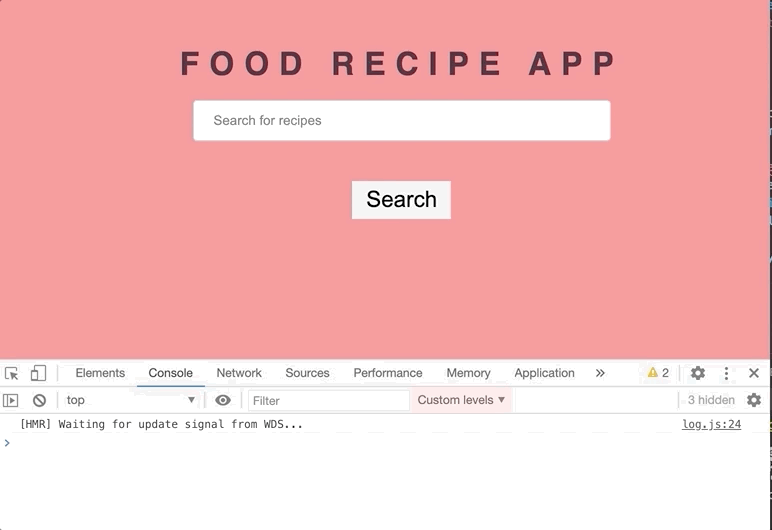

It's time to create our demo app!
In this app, we will create a Food Recipe app, we will fetch data from an Api and we will use both `useState` and `useEffect` hooks.

First, create a new file under `src > components` and name it `FoodRecipe.js`.
To be able to get a response for search queries, we need an APP ID, and APP_KEY.

## How Can I Fetch Data?

1. Go to [edamam.com](https://www.edamam.com/)
2. Choose `Recipe Search API` and click on `Sign Up`
3. Choose `Developer` and Click on `Start Now`
4. Fill out the form.
5. Go to `Dashboard`
6. Click on `Applications` > `View`. You should see your Application ID and Application Keys in this page.
7. Copy your keys and paste it inside the code.
8. API can give some errors, if you see any **CORS errors**, add a cors browser extension for the browser you are using. [Firefox](https://addons.mozilla.org/en-US/firefox/addon/cors-everywhere/) / [Chrome](https://chrome.google.com/webstore/detail/allow-cors-access-control/lhobafahddgcelffkeicbaginigeejlf/related)
9. Still, there is a problem? You need to wait until your API keys are available. Also, for free version, we can only make 5 requests per minute.
10. You can check out the [documentation.](https://developer.edamam.com/edamam-docs-recipe-api)

```js
// src > components > FoodRecipe.js
import React, {useEffect} from 'react';

const FoodRecipe = () => {
  // paste your APP_ID
  const APP_ID = '563ef9b6';
  // paste your APP_KEY
  const APP_KEY = 'a6adea137d5513370559c5fc6f3f3a91';

  const url = `https://api.edamam.com/search?q=chicken&app_id=${APP_ID}&app_key=${APP_KEY}`;

  // useEffect to make our API request
  useEffect(() => {
    getData();
  }, []);

  // created an async function to be able to fetch our data
  const getData = async (e) => {
    const response = await fetch(url);
    const result = await response.json();
    console.log(result);
  };

  // when you send the form, we call onSubmit handler to query the results
  const onSubmit = (e) => {
    // prevent browser refresh
    e.preventDefault();
    getData();
  };

  return (
    <div>
      <h1>Food Recipe App </h1>
      <form onSubmit={onSubmit}>
        <input type="text" placeholder="Search for recipes" />
        <button type="submit" className="btn">
          Search
        </button>
      </form>
    </div>
  );
};

export default FoodRecipe;
```



Let's see what we did in our code:

- created some JSX and added form, input and button properties.
- for the form submit, we need `onSubmit` event handler, and created the function for it. Used async/await and fetch browser API, to get our data from `edamam`.
- So, when we submit the form, we will fetch our recipes with the help of `useEffect` hook.
- As you can see, we ara calling our function to fetch our data.

```javascript
const onSubmit = (event) => {
  event.preventDefault();
  getData();
};
```

To be able to change our query from `chicken` search to any search, we need to add a state with `useState` hook.
Also, for the user search, we need to add a `state.`

```javascript
import React, {useState, useEffect} from 'react';
import Recipe from './Recipe';

const FoodRecipe = () => {
  // state for our API data
  const [recipes, setRecipes] = useState([]);

  const APP_ID = '';
  const APP_KEY = '';

  const url = `https://api.edamam.com/search?q=chicken&app_id=${APP_ID}&app_key=${APP_KEY}`;

  useEffect(() => {
    getData();
  }, []);

  const getData = async () => {
    const response = await fetch(url);
    const result = await response.json();
    console.log(result);
    // set the state for our results
    setRecipes(result.hits);
  };

  const onSubmit = (e) => {
    e.preventDefault();
    getData();
  };

  return (
    <div>
      <h1>Food Recipe App </h1>
      <form onSubmit={onSubmit}>
        <input
          type="text"
          value={search}
          onChange={(e) => setSearch(e.target.value)}
          autoComplete="off"
          placeholder="Search Food"
        />
        <button type="submit" className="btn" value="Search" />
      </form>
      {/* create JSX for our data from API */}
      <div className="recipes">
        {recipes !== [] &&
          recipes.map((recipe) => (
            <Recipe
              key={recipe.recipe.url}
              label={recipe.recipe.label}
              calories={recipe.recipe.calories}
              image={recipe.recipe.image}
              url={recipe.recipe.url}
            />
          ))}
      </div>
    </div>
  );
};

export default FoodRecipe;
```

Okay, here we have added our `recipes` state and updated with `setRecipes`. We need to display our recipes, for that let's create a `recipe` component.

Go to `src > components`, create a new component and name it `Recipe.js`. Copy this code and this code will allow us to display individual recipes.

```javascript
// src > components > Recipe.js

import React from 'react';

// inside recipe object destructure label,etc
const Recipe = ({label, calories, image, url, ingredients}) => {
  return (
    <div className="recipes">
      <h2>{label}</h2>
      <div>
        <ul>
          {ingredients.map((ingredient) => (
            <li key={ingredient.text}>{ingredient.text}</li>
          ))}
        </ul>
      </div>

      <p>{calories}</p>
      
      <a href={url} target="_blank">
        URL
      </a>
      <button>Ingredients</button>
    </div>
  );
};

export default Recipe;
```

```js
// src > components > FoodRecipe.js

import React, {useState} from 'react';

const FoodRecipe = () => {
  // create a state for search query
  const [search, setSearch] = useState('');
  // display the results with results state
  const [results, setResults] = useState([]);

  const APP_ID = '';
  const APP_KEY = '';

  // change chicken to search piece of state to make it dynamic
  const url = `https://api.edamam.com/search?q=${search}&app_id=${APP_ID}&app_key=${APP_KEY}`;

  const onSubmit = async (e) => {
    e.preventDefault();
    const response = await fetch(url);
    const result = await response.json();
    setResults(result.data.hits);
    // clear the input when we submit the form
    setSearch('');
  };

  return (
    <div>
      <h1>Food Recipe App </h1>
      <form onSubmit={onSubmit}>
        <input
          type="text"
          value={search}
          onChange={(event) => setSearch(event.target.value)}
        />
        <button type="submit" className="btn">
          Search
        </button>
      </form>
    </div>
  );
};

export default FoodRecipe;
```

`Input` is keeping track of its state with `search` state. We can get input's value from `event.target.value`.
Then we can change our state with `setSearch` function.

```javascript
<input
  type="text"
  value={search}
  onChange={(event) => setSearch(event.target.value)}
/>
```

// effect itself cannot be async
// inline the async function inside useEffect

Only make search after we click the `Search button`. Make a new state, name it `query`.

`query` will run only after form submit. Use it as a dependency inside the array.

If you run into any issues with your app or you have questions, please reach out to me on Twitter @hulyakarakayaa\_ or on Github.
