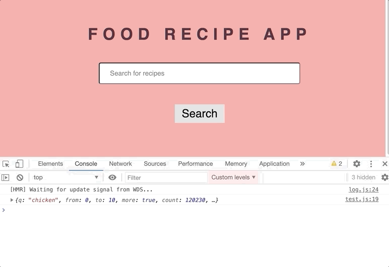
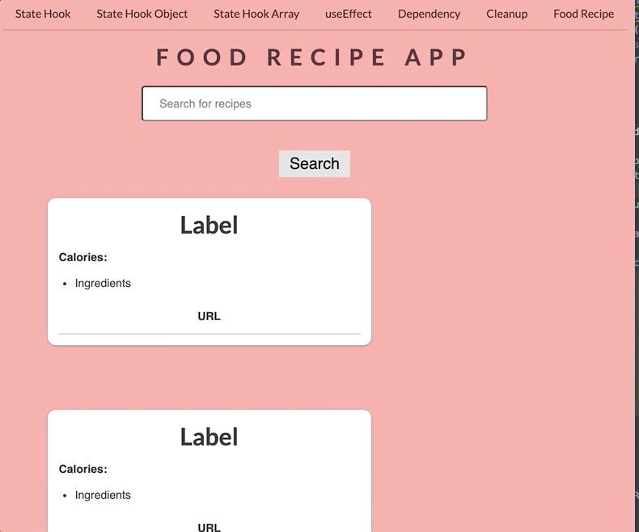

It's time to create our demo app!
In this app, we will create a Food Recipe app, we will fetch data from an Api and we will use both `useState` and `useEffect` hooks.

First, create a new file under `src > components` and name it `FoodRecipe.js`.
To be able to get a response for search queries, we need an APP ID, and an APP KEY.

## How Can I Fetch Data?

1. Go to [edamam.com](https://www.edamam.com/)
2. Choose `Recipe Search API` and click on `Sign Up`
3. Choose `Developer` and Click on `Start Now`
4. Fill out the form.
5. Go to `Dashboard`
6. Click on `Applications` > `View`. You should see your Application ID and Application Keys in this page.
7. Copy your keys and paste it inside the code.
8. API can give some errors, if you see any **CORS errors**, add a cors browser extension for the browser you are using. [Firefox](https://addons.mozilla.org/en-US/firefox/addon/cors-everywhere/) / [Chrome](https://chrome.google.com/webstore/detail/allow-cors-access-control/lhobafahddgcelffkeicbaginigeejlf/related)
9. Still, there is a problem? You need to wait until your API keys are available. Also, for free version, we can only make 5 requests per minute.
10. You can check out the [documentation.](https://developer.edamam.com/edamam-docs-recipe-api)

```js
// src > components > FoodRecipe.js

import React, {useEffect} from 'react';

const FoodRecipe = () => {
  // paste your APP_ID
  const APP_ID = '';
  // paste your APP_KEY
  const APP_KEY = '';

// url query is making a search for 'chicken' recipe
  const url = `https://api.edamam.com/search?q=chicken&app_id=${APP_ID}&app_key=${APP_KEY}`;

  // useEffect to make our API request
  useEffect(() => {
    getData();
  }, []);

  // created an async function to be able to fetch our data
  const getData = async (e) => {
    const response = await fetch(url);
    const result = await response.json();
    // console log the results we get from the api
    console.log(result);
  };

  return (
    <div>
      <h1>Food Recipe App </h1>
      <form>
        <input type="text" placeholder="Search for recipes" />
        <button type="submit" className="btn">
          Search
        </button>
      </form>
    </div>
  );
};

export default FoodRecipe;
```



Let's see what we did in our code:

- Created some JSX and added form, input and button properties.
- As you can see, we are calling our function to fetch our data.
- Created a `fetch` request to get our data, and used `useEffect` hook to call our function. As you can see, we are using our empty dependency array, because we will only make a request when our app loads. 

We got our API response, and we got a lot of information. You can see from the gif. Now, we need to create a state for our recipes, and we will update the recipes with the API data. We will only extract `hits` and its contents from our response. Let's do it!

```javascript
// src > components > FoodRecipe.js

import React, {useState, useEffect} from 'react';
// import Recipe component
import Recipe from './Recipe';

const FoodRecipe = () => {
  // state for our API data
  const [recipes, setRecipes] = useState([]);

  const APP_ID = '';
  const APP_KEY = '';

  const url = `https://api.edamam.com/search?q=chicken&app_id=${APP_ID}&app_key=${APP_KEY}`;

  useEffect(() => {
    getData();
  }, []);

  const getData = async () => {
    const response = await fetch(url);
    const result = await response.json();
    console.log(result);
    // set the state for our results and extract the 'hits' data
    setRecipes(result.hits);
  };

  // some ui
};

export default FoodRecipe;
```

Okay, here we have added our `recipes` state and updated with `setRecipes`. From our API call, we see that `hits` is an array, that's why for the default value we put an empty array.


We need to display our recipes, for that let's create a `Recipe` component.

Go to `src > components`, create a new component and name it `Recipe.js`. Copy this code and this code will allow us to display individual recipes.

Here, I have used some Semantic UI components to display our individual recipes.

```javascript
// src > components > Recipe.js

import React from 'react';

const Recipe = () => {
	return (
    <div class="ui column grid">
      <div className="column recipe">
        <div className="content">
          <h2>Label</h2>
          <p>Calories: </p>
          <ul>
            <li>Ingredients</li>
          </ul>
          <a href="" target="_blank">
            URL
          </a>
          </div>
        <div className="ui fluid card">
          
        </div>
      </div>
    </div>
	);
};

export default Recipe;
```

Now, we need to map over our recipes state, and display the results.

```javascript
// src > components > FoodRecipe.js

return (
    <div>
      <h1>Food Recipe App </h1>
      <form>
          <input type="text" placeholder="Search for recipes" />
          <button type="submit" className="btn">
            Search
          </button>
        </form>
        <div className="recipes">
          {/* map over our array and pass our data from API*/}
        {recipes !== [] &&
            recipes.map((recipe) => (
            <Recipe
              key={recipe.recipe.url}
              label={recipe.recipe.label}
              calories={recipe.recipe.calories}
              image={recipe.recipe.image}
              url={recipe.recipe.url}
              ingredients={recipe.recipe.ingredients}
            />
          ))}
        </div>
      </div>
  );
```

For now, I am getting our Recipe.js without any props, of course. 



Now, we can go to our `Recipe` component and pass our props to it. We are getting these props from the parent `FoodRecipe.js`. We will use destructuring.

```javascript
// src > components > Recipe.js

import React from 'react';

// inside recipe object destructure label, etc
const Recipe = ({label, calories, image, url, ingredients}) => {
  return (
    <div class="ui column grid">
        <div className="column recipe">
          <div className="content">
            <h2>{label}</h2>
            <p>{calories}</p>
            <ul>{ingredients.map((ingredient) => 
                <li key={ingredient.text}>{ingredient.text}</li>)}
            </ul>
            <a href={url} target="_blank">
              URL
            </a>
          </div>
          <div className="ui fluid card">
            
          </div>
        </div>
      </div>
  );
};

export default Recipe;
```


Tadaa!! We got our chickens! 

Now, we need to use our search bar and we will search the recipe from our input field. To get the state of our search bar, we will create a new piece of state.

Go to `FoodRecipe.js` and add new `search` state.

```javascript
// src > components > FoodRecipe.js

// create a state for search query
const [search, setSearch] = useState('');
```

And set the value for input value `search` and `setSearch` will update our input with the `onChange` event handler. `

`input` is keeping track of its state with `search` state. We can get input's value from `event.target.value`.
Then we can change our state with `setSearch` function.

```javascript
// src > components > FoodRecipe.js

<input
  type="text"
  value={search}
  onChange={(event) => setSearch(event.target.value)}
/>
```

We need to update our state, after we click on `Search Button`. That's why we need another state. And we can update our `url` from chicken query to any query. Make a new state, name it `query`.


```javascript
// src > components > FoodRecipe.js

const [query, setQuery] = useState('');

// when you send the form, we call onSubmit handler to query the results
const onSubmit = (e) => {
  // prevent browser refresh
  e.preventDefault();
  // setQuery for the finished search recipe
  setQuery(search);
};
```

Now, we need to pass our `query` state to our `onEffect` dependency array. Whenever we click on the Search button, we will call our API and change our state to new `query` state.

`query` will run only after form submit. Use it as a dependency inside the array. Our final code now looking like this:

```javascript
// src > component > FoodRecipe.js

import React, {useState, useEffect} from 'react';
import Recipe from './Recipe';

const FoodRecipe = () => {
  const [recipes, setRecipes] = useState([]);
  const [search, setSearch] = useState('');
  const [query, setQuery] = useState('');

  const APP_ID = '';
  const APP_KEY = '';

  const url = `https://api.edamam.com/search?q=${query}&app_id=${APP_ID}&app_key=${APP_KEY}`;

  useEffect(() => {
    getData();
  }, [query]);

  const getData = async () => {
    const response = await fetch(url);
    const result = await response.json();
    setRecipes(result.hits);
  };

  const onSubmit = (e) => {
    e.preventDefault();
    setQuery(search);
    // empty the input field after making search
    setSearch('');
  };

  return (
    <div>
      <h1>Food Recipe App </h1>
      <form onSubmit={onSubmit}>
        <input
          type="text"
          placeholder="Search for recipes"
          value={search}
          onChange={(e) => setSearch(e.target.value)}
        />
        <button type="submit" className="btn">
          Search
        </button>
      </form>
      <div className="ui two column grid">
        {recipes !== [] &&
          recipes.map((recipe) => (
            <Recipe
              key={recipe.recipe.url}
              label={recipe.recipe.label}
              calories={recipe.recipe.calories}
              image={recipe.recipe.image}
              url={recipe.recipe.url}
              ingredients={recipe.recipe.ingredients}
            />
          ))}
      </div>
    </div>
  );
};

export default FoodRecipe;
```


Time to enjoy your ice creams! I hope you liked the project.


